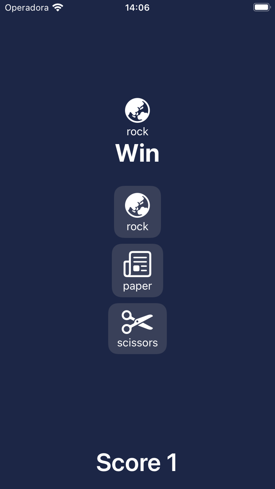
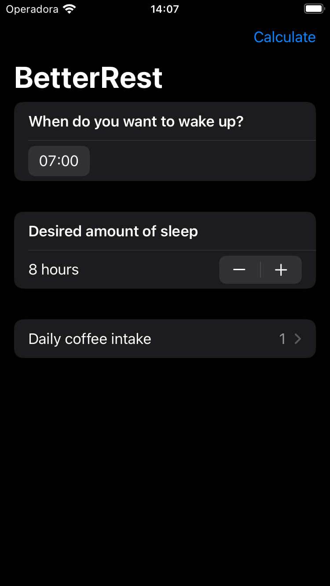
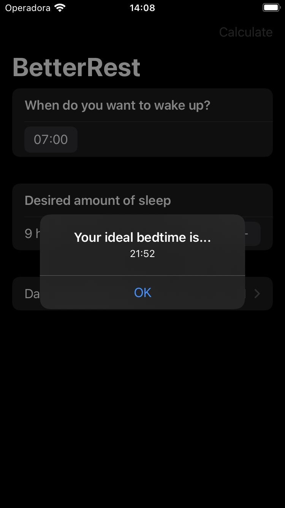
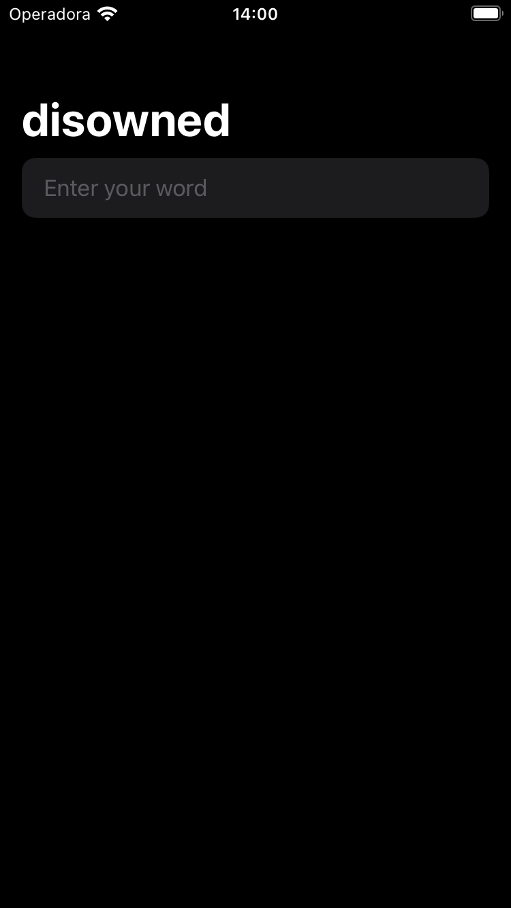
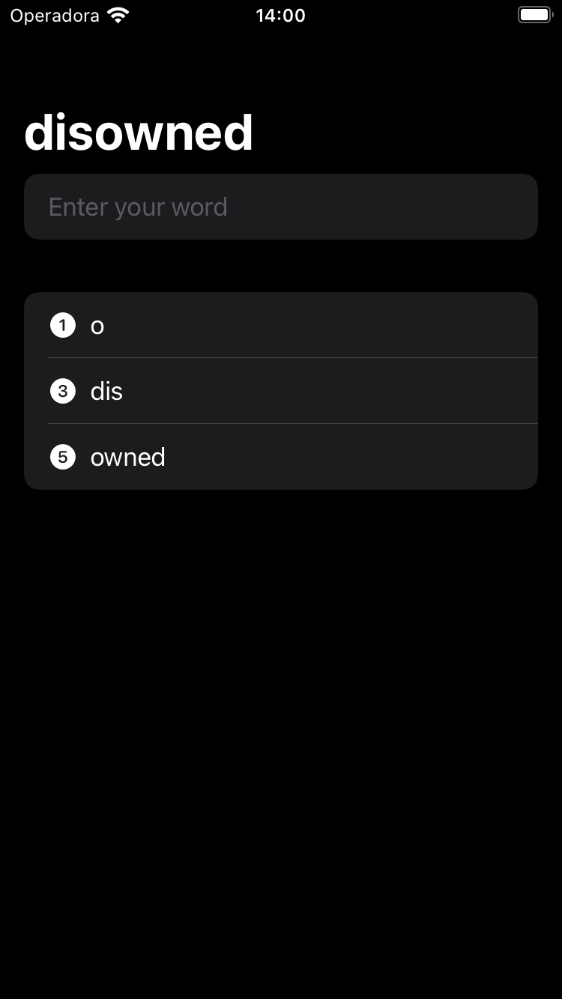
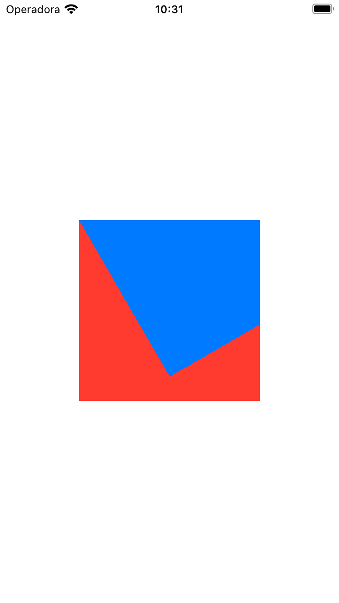
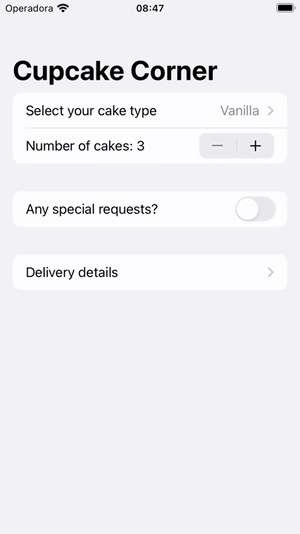

100 Days of SwiftUi by Hacking with Swift

# Projects
WeSplit

  
  

 

Guess The Flag

  
  

 

Rock Paper Scissors

  

 

BetterRest

  
  

 

WordScramble

  
  

 

Animation

  

 

Moonshot

  

 

CupcakeCorner

  

